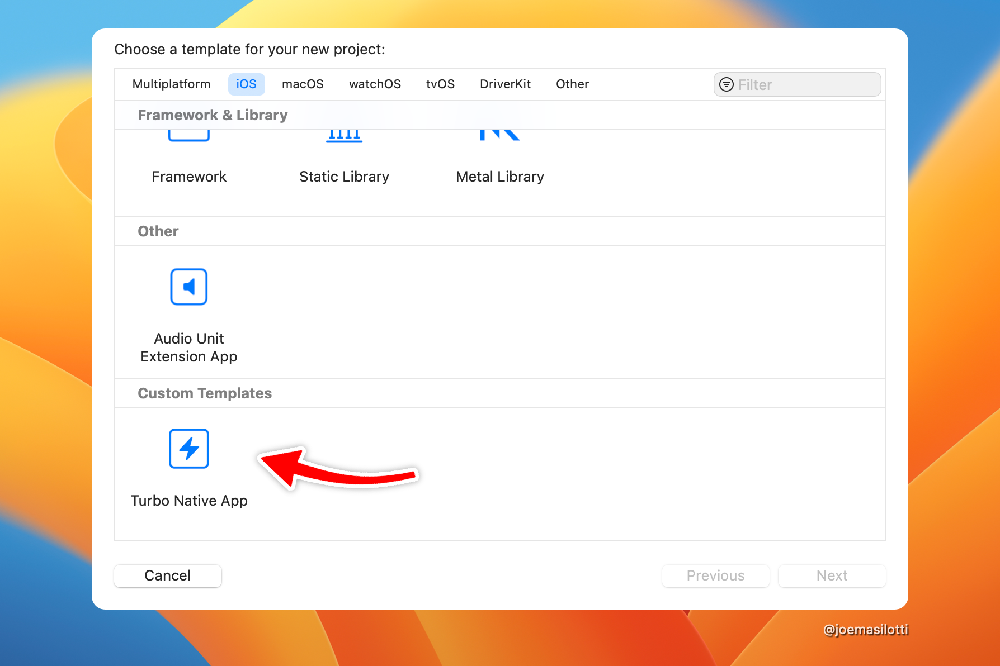

# Turbo Native app template for Xcode

A custom Xcode project template to get started with Turbo Native development.



Once installed, this template can be used directly in Xcode to generate a new Turbo Native project. It removes boilerplate around creating new Xcode projects and integrating with Turbo Native.

> **Note**: This project is an experiment with frequent, breaking changes as I learn how Xcode templates work.

## Getting started

First, make sure you have Xcode downloaded and installed from the [App Store](https://apps.apple.com/us/app/xcode/id497799835).

### Install the template

Create a new directory for custom Xcode project templates. Then clone this repo into that directory.

```bash
$ DIR=/Applications/Xcode.app/Contents/Developer/Library/Xcode/Templates/Custom\ Templates
$ mkdir -p $DIR
$ git clone git@github.com:joemasilotti/TurboNativeXcodeTemplate.git $DIR/Turbo\ Native\ App.xctemplate
```

### Create a new project

Open Xcode and create a new project via File → Project...

Select iOS from the tabs across the top and scroll to the bottom.

Select _Turbo Native App_, click Next, enter the name of your app, and click Next again.

### Add the Turbo Native package dependency

Unfortunately, Xcode project templates don't directly support Swift packages. So we have to add it manually.


1. Click the name of your app in the upper left.
1. Select the Project (not target) from the middle column.
1. Select the Package Dependencies tab from the top.
1. Click the `+` to add a new package.
1. In the upper right, enter `https://github.com/hotwired/turbo-ios`.
1. Click Add Package and Add Package again.

Run the app via Product → Run. If all went well it should launch in the simulator!

For the best experience, start a Rails server with Turbo.js enabled on port 3000.
